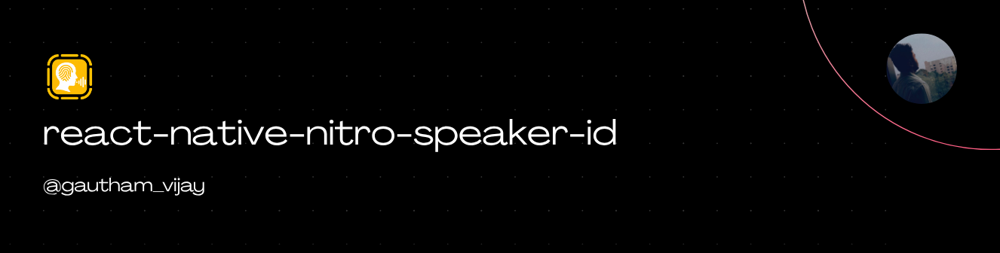
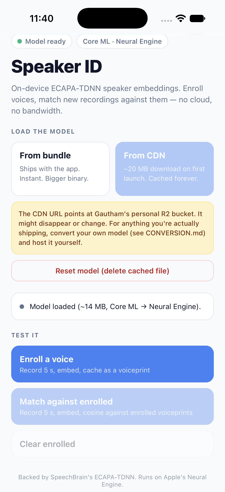
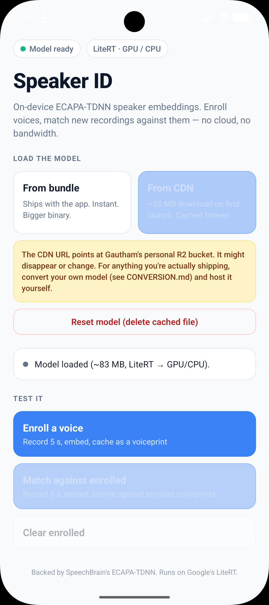

<a href="https://gauthamvijay.com">
  <picture>
    
  </picture>
</a>

# react-native-nitro-speaker-id

**React Native Nitro Module** for **on-device speaker identification** — ECAPA-TDNN embeddings running natively on the **Apple Neural Engine** and **Android CPU/NPU**. World's first for React Native.

---

> [!NOTE]
>
> - This library was built for my production app, an AI meeting intelligence platform, where we needed to label who was speaking during live sales calls — without shipping audio to the cloud, without per-turn latency, and without vendor lock-in.
> - It runs [SpeechBrain's ECAPA-TDNN](https://huggingface.co/speechbrain/spkrec-ecapa-voxceleb) speaker embedding model on-device via each platform's **native ML runtime**:
>   - **iOS** — Core ML → Neural Engine (A12+)
>   - **Android** — LiteRT (Google AI Edge) → CPU
>
> **What you get out of the box:**
>
> - True on-device inference — zero cloud calls, zero bandwidth, zero privacy leaks
> - 192-dimensional L2-normalized embeddings, cosine-comparable
> - Native mel-spectrogram feature extraction (Apple Accelerate on iOS, JTransforms FFT on Android)
> - Enroll voice samples, match new recordings against enrolled voiceprints
> - Latency: 8-40 ms per 1.5s window on flagship devices, 50-140 ms on mid-range Android
> - 16 KB page-aligned (Google Play compliant, unlike `tensorflow-lite` and `onnxruntime`)
>
> **What this library does NOT do** (by design):
>
> - Handle recording — pair with [react-native-nitro-audio-anvil](https://github.com/Gautham495/react-native-nitro-audio-anvil) for corruption-proof audio capture
> - Provide the ECAPA model file — you convert it once via the included Colab notebook and bundle/host it yourself
> - Voice activity detection — feed it audio windows where someone is actually speaking
> - Cloud speaker verification — this is 100% local; if you need a cloud fallback, that's your backend
>
> If you need on-device speaker identification for React Native — meeting transcription, voice-locked features, speaker diarization — this library gives you production-grade inference at native speed.

---

## 📦 Installation

```bash
npm install react-native-nitro-speaker-id react-native-nitro-modules
```

**iOS only:**

```bash
cd ios && bundle exec pod install
```

**Android** — add JTransforms (used for the mel-spectrogram FFT) to your `android/build.gradle` `allprojects`:

```gradle
allprojects {
    repositories {
        google()
        mavenCentral()
        maven { url 'https://jitpack.io' }
    }
}
```

> [!IMPORTANT]
>
> - **iOS**: Fully tested and production-ready ✅
>   - Core ML runtime, Neural Engine acceleration on A12+
>   - Native `vDSP` mel-spectrogram via Apple's Accelerate framework
>   - Zero third-party ML dependencies
> - **Android**: Fully tested and production-ready ✅
>   - LiteRT runtime (Google's replacement for the deprecated `tensorflow-lite`)
>   - JTransforms FFT for the mel-spectrogram front-end
>   - CPU-only for reliability across device makers
>   - 16 KB page-aligned — Google Play submission-ready
> - Tested on React Native 0.85.3 and above. PRs welcome for lower versions.

---

## 🎥 Demo

<table>
  <tr>
    <th align="center">🍏 iOS Demo</th>
    <th align="center">🤖 Android Demo</th>
  </tr>
  <tr>
    <td align="center">
    
    </td>
     <td align="center">
    
    </td>
  </tr>
</table>

---

> [!NOTE]
>
> The ECAPA-TDNN model file (~14 MB for iOS Core ML, ~40 MB for Android TFLite) is not bundled with the library. Convert it once from SpeechBrain's checkpoint using the Colab notebook in [ECAPA-CONVERSION.md](./ECAPA-CONVERSION.md), then bundle it in your app or host it on your own CDN.
>
> Pre-converted models are available on my personal Cloudflare R2 bucket for testing:
>
> - iOS: `https://ml-models-bucket.gauthamvijay.com/ecapa-body-192.mlpackage.zip`
> - Android: `https://ml-models-bucket.gauthamvijay.com/ecapa-body-192.tflite`
>
> ⚠️ **This is my personal bucket for demo purposes only.** I may delete or reshuffle it whenever. For anything you're actually shipping, convert your own model and host it yourself.

---

## 🧠 Overview

| Feature                      | Implementation                            |
| ---------------------------- | ----------------------------------------- |
| On-device speaker embeddings | ECAPA-TDNN (SpeechBrain)                  |
| iOS ML runtime               | Core ML → Neural Engine / GPU / CPU       |
| Android ML runtime           | LiteRT (Google AI Edge) → CPU             |
| Mel-spectrogram (iOS)        | Apple Accelerate (`vDSP`)                 |
| Mel-spectrogram (Android)    | JTransforms FFT                           |
| Model format (iOS)           | Core ML `.mlpackage` (FP16 quantized)     |
| Model format (Android)       | TFLite `.tflite` (FP32 or FP16)           |
| Input                        | PCM16 mono 16 kHz                         |
| Output                       | 192-d Float32, L2-normalized              |
| Similarity metric            | Cosine (dot product on L2-normed vectors) |
| 16 KB page alignment         | ✅ Both platforms                         |
| Cloud dependency             | ❌ None (fully offline)                   |

---

## 📈 Latency

Measured on a 1.5-second audio window (native mel-spectrogram ~2-5 ms + ML runtime):

| Device                      | Backend           | Total   |
| --------------------------- | ----------------- | ------- |
| iPhone 15 Pro (A17 Pro)     | Core ML → ANE     | ~8 ms   |
| iPhone 12 (A14)             | Core ML → ANE     | ~18 ms  |
| iPhone SE 3 (A15)           | Core ML → ANE     | ~14 ms  |
| iPhone X (A11, no ANE)      | Core ML → GPU/CPU | ~60 ms  |
| Galaxy S23 (SD 8 Gen 2)     | LiteRT → CPU      | ~22 ms  |
| Pixel 8 (Tensor G3)         | LiteRT → CPU      | ~28 ms  |
| Pixel 6a (Tensor G1)        | LiteRT → CPU      | ~45 ms  |
| Vivo mid-range (SD 680/720) | LiteRT → CPU      | ~90 ms  |
| Low-end 2020 Android        | LiteRT → CPU      | ~140 ms |

Latency scales linearly with input duration. A 3-second window roughly doubles these numbers.

---

## ⚙️ Basic Usage

```tsx
import { Platform } from 'react-native';
import { SpeakerId } from 'react-native-nitro-speaker-id';

// 1. Load the platform-appropriate model once at app start.
const modelPath = Platform.OS === 'ios'
  ? '/path/to/ecapa-body-192.mlpackage'
  : '/path/to/ecapa-body-192.tflite';

await SpeakerId.loadModel(modelPath);

// 2. Enroll each speaker with a clean 5-10 second sample.
const enrollmentPcm: ArrayBuffer = await recordCleanSample();
const gauthamsVoiceprint = await SpeakerId.embed(enrollmentPcm, 16000);
// gauthamsVoiceprint is a Float32Array of length 192

// 3. During a meeting, embed each speaker turn and cosine-match.
const turnPcm: ArrayBuffer = /* from your recorder */;
const turnEmbedding = await SpeakerId.embed(turnPcm, 16000);

const similarity = SpeakerId.cosine(turnEmbedding, gauthamsVoiceprint);
console.log('cosine:', similarity);
// > 0.55  → almost certainly Gautham
// 0.35-0.55 → probably Gautham (phone audio)
// < 0.35  → probably not Gautham
```

---

## 📚 API

### `SpeakerId.loadModel(modelPath: string): Promise<void>`

Load the ECAPA model from a filesystem path. Idempotent for the same path. Loading a different path unloads the previous model first. Throws if the file doesn't exist.

- On **iOS**, pass a `.mlpackage` (compiled at runtime) or precompiled `.mlmodelc`
- On **Android**, pass a `.tflite` file

### `SpeakerId.isLoaded: boolean`

`true` after `loadModel()` has resolved and before `unloadModel()` is called.

### `SpeakerId.unloadModel(): void`

Release the model handle and free runtime memory. Call at logout or when backgrounding. Idempotent.

### `SpeakerId.embed(pcm: ArrayBuffer, sampleRate?: number): Promise<Float32Array>`

Embed a single PCM audio buffer.

- `pcm` — signed 16-bit little-endian samples, mono
- `sampleRate` — defaults to 16000; other rates are linearly resampled
- Returns a 192-element `Float32Array`, L2-normalized

### `SpeakerId.cosine(a, b): number`

Cosine similarity between two L2-normalized embeddings. Range `[-1, 1]`. Both arguments can be `Float32Array` or raw `ArrayBuffer`.

---

## 🎯 Thresholds

Cosine scores on L2-normalized ECAPA embeddings typically land in these ranges:

- **Same speaker, clean audio**: 0.55 – 0.85
- **Same speaker, phone / noisy audio**: 0.35 – 0.55
- **Different speakers**: -0.05 – 0.35

Starting threshold: **0.40**. Log real scores from your first week of production and tune from there — the correct number depends on your microphone, your users, and your acoustic environment.

---

## 🎁 Getting the Model

Two files, one per platform. Both derived from SpeechBrain's ECAPA-TDNN checkpoint so client-side matching is cosine-compatible with cloud voiceprints.

### Option 1: Download from my CDN (fastest, for testing)

- iOS: `https://ml-models-bucket.gauthamvijay.com/ecapa-body-192.mlpackage.zip` (~39 MB, unzip after download)
- Android: `https://ml-models-bucket.gauthamvijay.com/ecapa-body-192.tflite` (~40 MB with FP16 quantization)

Because Core ML's `.mlpackage` is a directory (not a single file), it can't be served over plain HTTP. The download is a ZIP wrapper that must be unpacked after fetch — see the example app for the full flow using `react-native-zip-archive`.

⚠️ **The R2 bucket is my personal hosting for demo purposes only.** For production, convert your own model (see below) and host it yourself.

### Option 2: Convert yourself (recommended for production)

Takes ~5 minutes in a free Google Colab session. Matches your Python cloud model exactly. See [CONVERSION.md](./CONVERSION.md) for the notebook and step-by-step guide.

---

## 🧩 Supported Platforms

| Platform             | Status                                      |
| -------------------- | ------------------------------------------- |
| **iOS**              | ✅ Fully Supported                          |
| **Android**          | ✅ Fully Supported                          |
| **iOS Simulator**    | ✅ Works                                    |
| **Android Emulator** | ⚠️ CPU only (emulator GPU delegate crashes) |

### iOS Requirements

- **Minimum iOS**: 16.0 (for Core ML ML Program format)
- No additional dependencies — everything ships in Apple's frameworks

### Android Requirements

- **Minimum SDK**: API 24 (Android 7.0)
- **Dependencies**: `com.google.ai.edge.litert:litert:2.1.0`, `com.github.wendykierp:JTransforms:3.1`
- **16 KB page alignment**: automatic (both LiteRT and this library ship aligned .so files)

---

## 🆚 Comparison

|                         | Cloud ECAPA | ONNX Runtime | tensorflow-lite | This library            |
| ----------------------- | ----------- | ------------ | --------------- | ----------------------- |
| Latency per turn        | 150-400 ms  | 30-80 ms     | 30-80 ms        | 8-140 ms                |
| Cost per meeting        | ~$0.008     | 0            | 0               | 0                       |
| Bandwidth per meeting   | ~14 MB      | 0            | 0               | 0                       |
| Works offline           | No          | Yes          | Yes             | Yes                     |
| Voice data leaves phone | Yes         | No           | No              | No                      |
| APK size overhead       | 0           | ~40 MB       | ~15 MB          | ~4 MB                   |
| 16 KB page-aligned      | N/A         | No (2026)    | No (2026)       | Yes                     |
| Vendor dependency       | Backend     | Microsoft    | Google (legacy) | Apple + Google (native) |

---

## 🤝 Pairs With

- [react-native-nitro-audio-anvil](https://github.com/Gautham495/react-native-nitro-audio-anvil) — corruption-proof audio recording. Its `SpeakerWindow.buffer` is exactly the shape `embed()` expects. Together they enable live speaker-labeled transcription entirely on-device.
- [react-native-nitro-cloud-uploader](https://github.com/Gautham495/react-native-nitro-cloud-uploader) — for when the recording ends and you want to ship the audio artifact to S3-compatible storage for archival or async processing.

---

## 🤝 Contributing

Contributions are welcome!

- [Development Workflow](CONTRIBUTING.md#development-workflow)
- [Sending a Pull Request](CONTRIBUTING.md#sending-a-pull-request)
- [Code of Conduct](CODE_OF_CONDUCT.md)

---

## 🪪 License

MIT © [**Gautham Vijayan**](https://gauthamvijay.com)

---

Made with ❤️ and [**Nitro Modules**](https://nitro.margelo.com)
